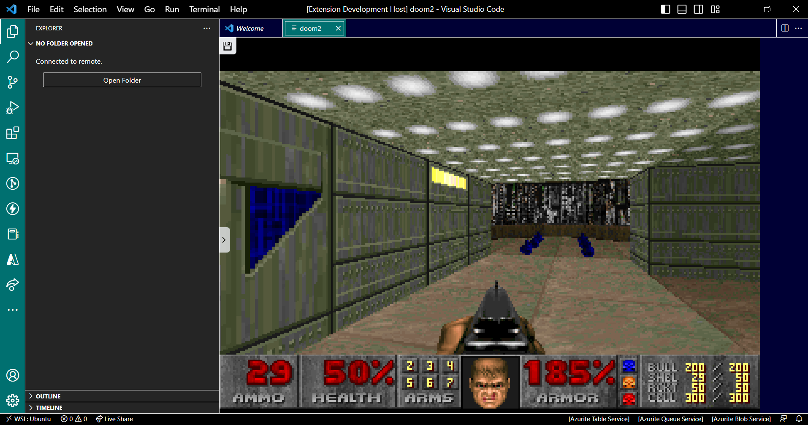

# VS-DOS

A js-dos / dos.zone wrapper for running MS-DOS applications inside VS-Code.

### Instructions:

Just select one of the available commands by pressing F1, for now there's only a few games available.

### Available commands:

- vsDos.doom
- vsDos.doom2
- vsDos.finalDoom
- vsDos.ultimateDoom

### Limitations:

For now it's not possible to load your own ms-dos programms and not all games from dos.zone are available to be played, since I have to manually add them. Since Doom is my favorite game, I've started with making the classic doom games available.

### Future:

I pretend to support all dos.zone remote games and local ms-dos-compatible files.
